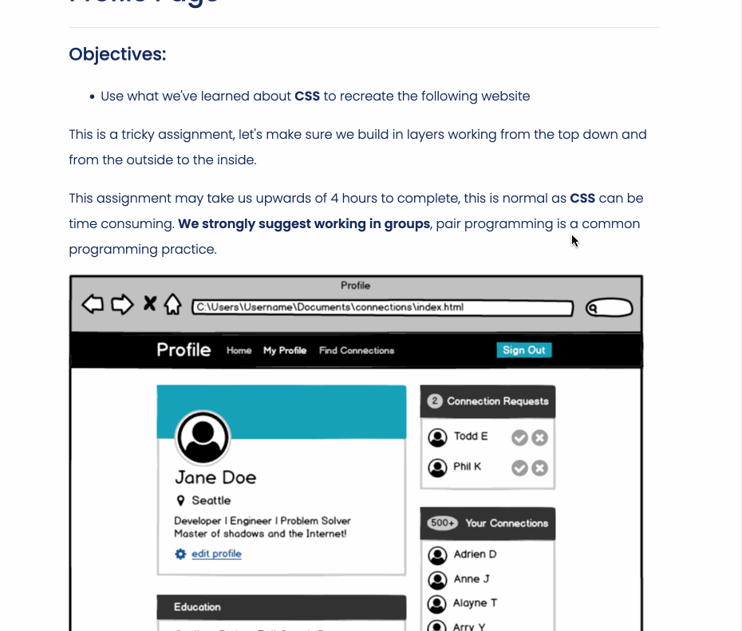

# Profile Page Assignment
At the end of the CSS section of the Web Fundamentals module in my Coding Dojo software development bootcamp, we were assigned to recreate an image of a website by using HTML and CSS. This assignment was a great opportunity to practice wireframing with HTML divs and to use CSS Flexbox principles to correctly space elements. Below is a GIF of the assignment page:

